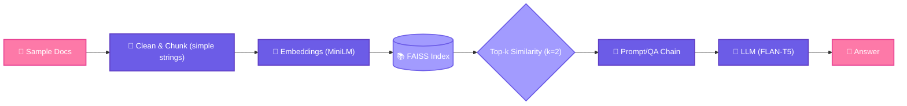

# 🚀 Pipeline RAG LangChain

> ✨ **Pipeline didático de Retrieval-Augmented Generation (RAG)** construído com **LangChain** — focado em um pipeline *mínimo* e reproduzível: **HuggingFace embeddings → FAISS retriever → LLM local (FLAN‑T5)**, com fallback opcional para OpenAI. Ideal para ensinar conceitos modernos de RAG passo a passo.

<div align="center">

[](https://python.org)
[](https://langchain.com)
[](https://huggingface.co/transformers)
[](https://faiss.ai)

[🎯 Quickstart](#-quickstart) • [📚 Como funciona](#-como-funciona) • [🏗️ Arquitetura](#️-arquitetura) • [📋 Roadmap](#-roadmap)

</div>

---

## 🎯 Destaques

<table>
<tr>
<td>

**🎓 Didático**
- Pipeline minimalista e bem documentado
- Exemplos práticos passo a passo
- Ideal para aprender conceitos de RAG

</td>
<td>

**⚡ Performance**
- Embeddings leves (MiniLM)
- Índice FAISS otimizado
- Funciona em CPU ou GPU

</td>
<td>

**🔧 Flexível**
- LLM local (FLAN-T5) por padrão
- Fallback opcional para OpenAI
- Configurações personalizáveis

</td>
</tr>
</table>

---

## 🧰 Stack Tecnológico

<div align="center">

| Categoria | Tecnologia | Descrição |
|-----------|------------|-----------|
| **🧠 LLM** | FLAN-T5 (local) + OpenAI (opcional) | Modelos de linguagem para geração |
| **🔍 Embeddings** | HuggingFace MiniLM | Embeddings rápidos e leves |
| **📊 Vector Store** | FAISS | Índice vetorial para busca por similaridade |
| **⚙️ Framework** | LangChain | Orquestração do pipeline RAG |
| **🐍 Linguagem** | Python 3.10+ | Linguagem principal do projeto |

</div>

> **💡 Filosofia do projeto**: Orientado ao ensino com documentos pequenos curados, índice FAISS simples e LLM local (FLAN‑T5) para que estudantes possam executar tudo em CPU/GPU (ex: Colab) sem serviços externos.

---

## 🏗️ Arquitetura



### 🔧 Componentes Principais

- **📝 Corpus Minimalista**: Lista pequena de strings sobre churn, NPS, LangChain, RAG e embeddings
- **🧮 Embeddings**: `sentence-transformers/all-MiniLM-L6-v2` (rápido e leve)
- **🗃️ Índice Vetorial**: FAISS para busca por similaridade
- **🔍 Retriever**: Top-k similarity (k=2) configurável
- **🤖 LLM**: FLAN-T5 local via transformers pipeline
- **🔗 Chain**: RetrievalQA usando LangChain

---

## 🚀 Quickstart

### 1️⃣ Instalação

```bash
# Clone o repositório
git clone https://github.com/seu-usuario/pipeline-rag-langchain.git
cd pipeline-rag-langchain

# Crie ambiente virtual (opcional mas recomendado)
python -m venv .venv
source .venv/bin/activate  # Windows: .venv\Scripts\activate

# Instale dependências
pip install -U pip
pip install faiss-cpu sentence-transformers langchain langchain-community transformers torch
```

### 2️⃣ Configuração (Opcional)

```bash
# Para habilitar fallback OpenAI
export OPENAI_API_KEY=sk-...  # Windows PowerShell: $env:OPENAI_API_KEY="sk-..."
```

### 3️⃣ Execução

```bash
# Execute o notebook
jupyter notebook notebooks/pipeline_rag_langchain.ipynb

# Ou abra diretamente no Google Colab
# https://colab.research.google.com/github/seu-usuario/pipeline-rag-langchain/blob/main/notebooks/pipeline_rag_langchain.ipynb
```

---

## 📚 Como Funciona

### 🔄 Fluxo do Pipeline

1. **📄 Corpus de Exemplo**: Documentos pequenos sobre conceitos de ML/AI
2. **🔤 Embeddings**: Conversão de texto para vetores usando MiniLM
3. **🗄️ Indexação**: Criação do índice FAISS para busca vetorial
4. **🔍 Retrieval**: Busca dos k documentos mais similares
5. **🧠 Geração**: LLM processa contexto + pergunta → resposta
6. **✅ Resposta**: Saída final formatada

### 💻 Exemplo de Código

```python
# 1) Documentos de exemplo
docs = [
    "O churn é o cancelamento de clientes...",
    "NPS, ou Net Promoter Score, mede satisfação...",
    "LangChain é uma biblioteca para aplicações LLM...",
    "RAG combina recuperação de informação com geração...",
]

# 2) Setup do pipeline
from langchain_community.embeddings import HuggingFaceEmbeddings
from langchain_community.vectorstores import FAISS
from langchain.chains import RetrievalQA

# Embeddings + Índice FAISS
embeddings = HuggingFaceEmbeddings(model_name="sentence-transformers/all-MiniLM-L6-v2")
vectorstore = FAISS.from_texts(docs, embeddings)
retriever = vectorstore.as_retriever(search_kwargs={"k": 2})

# LLM Local (FLAN-T5)
from transformers import pipeline
from langchain_community.llms import HuggingFacePipeline

gen_pipeline = pipeline("text2text-generation", model="google/flan-t5-base", max_new_tokens=256)
llm = HuggingFacePipeline(pipeline=gen_pipeline)

# 3) Chain RAG
qa_chain = RetrievalQA.from_chain_type(llm=llm, retriever=retriever)

# 4) Fazer perguntas
resposta = qa_chain.invoke({"query": "O que significa churn?"})
print(resposta["result"])
```

---

## 🧪 Avaliação e Testes

### 🎯 Métricas Qualitativas

- **Groundedness**: Respostas refletem documentos recuperados?
- **Relevância**: Retrieval retorna contexto apropriado?
- **Fluência**: Respostas são coerentes e bem formadas?

### ⏱️ Benchmark Rápido

```python
import time

perguntas_teste = [
    ("O que significa churn?", "churn"),
    ("Como funciona RAG?", "RAG"),
    ("O que é NPS?", "NPS"),
]

for pergunta, termo_esperado in perguntas_teste:
    inicio = time.time()
    resultado = qa_chain.invoke({"query": pergunta})
    tempo = time.time() - inicio
    
    print(f"❓ {pergunta}")
    print(f"✅ {resultado['result']}")
    print(f"⏱️ {tempo:.2f}s\n")
```

---

## 📁 Estrutura do Projeto

```
pipeline-rag-langchain/
├── 📁 config/                  # Configurações Hydra
│   ├── main.yaml              # Configuração principal
│   ├── model/                 # Parâmetros de modelos
│   └── process/               # Parâmetros de processamento
├── 📁 data/                   # Dados do projeto
│   ├── raw/                   # Dados brutos
│   ├── processed/             # Dados processados
│   └── final/                 # Dados finais
├── 📁 notebooks/              # Jupyter notebooks
│   └── pipeline_rag_langchain.ipynb
├── 📁 src/                    # Código fonte
│   ├── __init__.py
│   ├── process.py
│   ├── train_model.py
│   └── utils.py
├── 📁 tests/                  # Testes automatizados
├── 📁 docs/                   # Documentação
├── 📁 models/                 # Modelos salvos
├── pyproject.toml             # Dependências Poetry
├── .pre-commit-config.yaml    # Configurações pre-commit
└── README.md                  # Este arquivo
```

---

## 🛠️ Ferramentas Utilizadas

<details>
<summary><b>🔧 Clique para ver todas as ferramentas</b></summary>

| Ferramenta | Propósito | Documentação |
|------------|-----------|--------------|
| **Poetry** | Gerenciamento de dependências | [📖 Guia Poetry](https://python-poetry.org/) |
| **Hydra** | Gerenciamento de configurações | [📖 Hydra Docs](https://hydra.cc/) |
| **Pre-commit** | Formatação automática de código | [📖 Pre-commit Hooks](https://pre-commit.com/) |
| **Pdoc** | Documentação automática da API | [📖 Pdoc](https://pdoc.dev/) |
| **Pytest** | Framework de testes | [📖 Pytest](https://pytest.org/) |

</details>

---

## 🚀 Setup Desenvolvimento

### 1️⃣ Ambiente Poetry

```bash
# Instalar Poetry
curl -sSL https://install.python-poetry.org | python3 -

# Ativar ambiente virtual
poetry shell

# Instalar dependências
poetry install              # Todas as dependências
poetry install --only main  # Apenas produção
```

### 2️⃣ Pre-commit Hooks

```bash
# Configurar pre-commit
poetry run pre-commit install

# Executar manualmente
poetry run pre-commit run --all-files
```

### 3️⃣ Documentação

```bash
# Gerar documentação estática
poetry run pdoc src -o docs

# Servidor de documentação (http://localhost:8080)
poetry run pdoc src --http localhost:8080
```

### 4️⃣ Configurações com Hydra

```bash
# Ver configurações disponíveis
poetry run python src/process.py --help

# Override configurações
poetry run python src/process.py data.raw=novo_arquivo.csv model=model2
```

---

## 📋 Roadmap

### 🎯 Próximas Features

- [ ] **🔄 MMR Retriever**: Opção de Maximum Marginal Relevance
- [ ] **📄 Loaders**: Suporte para PDF e Markdown
- [ ] **💾 Persistência**: Save/load do índice FAISS
- [ ] **🌐 OpenAI Integration**: Path completo com embeddings OpenAI
- [ ] **📊 Métricas**: Dashboard de avaliação de performance
- [ ] **🎨 Streamlit Demo**: Interface web interativa
- [ ] **📱 Colab Badge**: Botão de abertura direta no Colab

### 🎨 Melhorias de UX

- [ ] **📈 Logging**: Sistema de logs estruturado
- [ ] **⚡ Cache**: Cache de embeddings para desenvolvimento
- [ ] **🐳 Docker**: Containerização completa
- [ ] **📋 Templates**: Templates para diferentes tipos de documentos

---

## 🤝 Contribuindo

Contribuições são bem-vindas! Por favor:

1. **🍴 Fork** o projeto
2. **🌟 Crie** uma feature branch (`git checkout -b feature/AmazingFeature`)
3. **💾 Commit** suas mudanças (`git commit -m 'Add some AmazingFeature'`)
4. **📤 Push** para a branch (`git push origin feature/AmazingFeature`)
5. **🔄 Abra** um Pull Request

---

## 📄 Licença

Este projeto está licenciado sob a MIT License - veja o arquivo [LICENSE](LICENSE) para detalhes.

---

## 🙏 Agradecimentos

- **🤗 HuggingFace** pelos modelos e transformers
- **🦜 LangChain** pelo framework RAG
- **🔍 FAISS** pela busca vetorial eficiente
- **🐍 Python Community** pelas bibliotecas incríveis

---

<div align="center">

**⭐ Se este projeto te ajudou, deixe uma estrela!**

Made with ❤️ and lots of ☕

</div>
