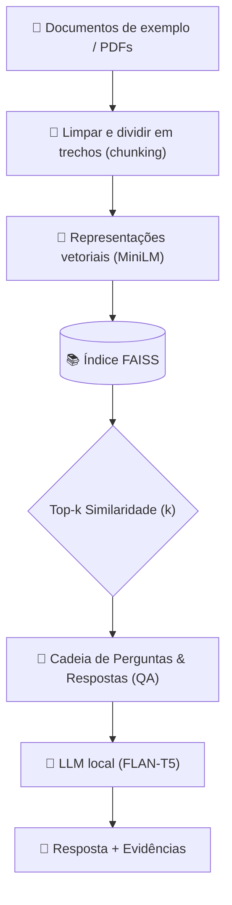

# 🚀 MIGUEL - Chatbot didático

> ✨ **Pipeline didático de Retrieval-Augmented Generation (RAG)** construído com **LangChain** — focado em um pipeline *mínimo* e reproduzível: **HuggingFace embeddings → FAISS retriever → LLM local (FLAN‑T5)**. Ideal para ensinar conceitos modernos de RAG passo a passo com **controles interativos**.

<div align="center">

[](https://python.org)
[](https://langchain.com)
[](https://huggingface.co/transformers)
[](https://faiss.ai)

[🎯 Quickstart](#-quickstart) • [🎛️ Controles Interativos](#️-controles-interativos) • [📚 Como funciona](#-como-funciona) • [🏗️ Arquitetura](#️-arquitetura) • [📋 Roadmap](#-roadmap)

</div>

---

## 📂 Estrutura do Projeto

```
Miguel_LLM-educacional/
├── 📁 .streamlit/          # Configurações do Streamlit
├── 📁 config/              # Arquivos de configuração
├── 📁 data/                # Datasets, PDFs e corpus
├── 📁 docs/                # Documentação
├── 📁 models/              # Modelos treinados
├── 📁 notebooks/           # Jupyter notebooks
├── 📁 src/                 # Código-fonte
│   ├── 📁 app/             # Aplicação Streamlit
│   │   ├── 🐍 __init__.py
│   │   ├── 🐍 app.py           # Interface principal
│   │   └── 🐍 run_app.py       # Script de execução
│   ├── 📁 core/            # Lógica RAG/LLM
│   │   ├── 🐍 __init__.py
│   │   ├── 🐍 process.py       # Pipeline de processamento
│   │   ├── 🐍 train_model.py   # Treinamento
│   │   └── 🐍 utils.py         # Utilitários do core
│   ├── 📁 utils/           # Utilitários gerais
│   │   └── 🐍 __init__.py
│   └── 🐍 __init__.py
├── 📁 tests/               # Testes unitários
├── 📦 .gitignore
├── 📦 .pre-commit-config.yaml
├── 📝 README.md
├── 📦 pyproject.toml
├── 📦 requirements.txt
└── 📦 runtime.txt
```

---


## 🎯 Destaques

<table>
<tr>
<td>

**🎓 Didático**
- Pipeline minimalista e bem documentado
- Exemplos práticos passo a passo
- **Controles interativos** para experimentar parâmetros

</td>
<td>

**⚡ Performance**
- Embeddings leves (MiniLM)
- Índice FAISS otimizado
- Funciona em CPU

</td>
<td>

**🔧 Flexível**
- LLM local (FLAN-T5) por padrão
- Base de conhecimento expansível via PDFs
- **Observabilidade didática** (métricas e evidências)

</td>
</tr>
</table>

---

## 🧰 Stack Tecnológico

<div align="center">

| Categoria | Tecnologia | Descrição |
|-----------|------------|-----------|
| **🧠 LLM** | FLAN-T5 (local) | Modelo de linguagem para geração |
| **🔍 Embeddings** | HuggingFace MiniLM | Embeddings rápidos e leves |
| **📊 Vector Store** | FAISS | Índice vetorial para busca por similaridade |
| **⚙️ Framework** | LangChain | Orquestração do pipeline RAG |
| **🖥️ Interface** | Streamlit | UI interativa com controles didáticos |
| **🐍 Linguagem** | Python 3.10+ | Linguagem principal do projeto |

</div>

> **💡 Filosofia do projeto**: Orientado ao ensino, com base pequena e controlável, índice FAISS simples e LLM local (FLAN-T5) para que estudantes executem tudo sem serviços externos.

---

## 🎛️ Controles Interativos (como usar o aplicativo)

O MIGUEL foi feito para **aprender fazendo**. Na barra lateral do aplicativo (sidebar), você encontra **controles que mudam o comportamento** do RAG e do LLM.

### 🧭 Navegação do aplicativo
- **Chat**: onde você faz perguntas e vê **resposta + evidências** (trechos recuperados).
- **Documentos**: onde você **envia PDFs** para expandir a base de conhecimento.
- **Glossário & Ajuda**: explica todos os termos técnicos do app (RAG, embeddings, FAISS, retriever etc.).

### 1) 🔎 Top-k (k): trechos recuperados
**O que controla:** quantos trechos do FAISS o sistema recupera para “alimentar” o LLM.

- **k menor (ex.: 1–2)**: respostas podem ficar **rápidas**, mas podem faltar evidências/contexto.
- **k maior (ex.: 5–8)**: mais contexto, mas pode entrar **ruído** (trechos pouco relevantes).

✅ **Sugestão didática:** faça a mesma pergunta com k=2 e depois k=6 e compare:
- A resposta mudou?
- As evidências ficaram mais relevantes?

### 2) 🎚️ Temperatura (criatividade)
**O que controla:** quanta “aleatoriedade” o LLM usa para gerar respostas.

- **temperatura baixa (0.0–0.3)**: mais **estável** e “objetiva”.
- **temperatura média (0.4–0.8)**: equilíbrio.
- **temperatura alta (0.9–1.2)**: mais variação, mas pode aumentar erros.

✅ **Sugestão didática:** pergunte algo conceitual (“o que é RAG?”) e veja se, com temperatura alta, aparecem variações e imprecisões.

### 3) 🧾 Tamanho máximo da resposta (tokens)
**O que controla:** o quanto o modelo pode escrever.

- **baixo (64–256)**: respostas curtas (bom para exercícios).
- **alto (512–1024)**: respostas mais longas (pode aumentar tempo de execução).

✅ **Sugestão didática:** combine com Top-k:
- Se aumentar muito k e tokens, o tempo tende a aumentar.

### 4) ✅ Botão “Aplicar”
Ao clicar em **Aplicar**, o pipeline é **recarregado** com os novos parâmetros.

> Importante: alterações só entram em vigor após **Aplicar**.

### 5) ↩️ Botão “Padrão”
Restaura os valores recomendados (baseline didático), por exemplo:
- **Top-k = 3**
- **Temperatura = 0.7**
- **Tokens = 512**

✅ Use “Padrão” quando quiser voltar ao comportamento “normal” após experimentar.

### 6) 📎 Upload de PDFs (aba Documentos)
**O que acontece ao enviar um PDF:**
1. O texto é dividido em trechos (chunking)
2. Cada trecho vira embedding (vetor)
3. Tudo é indexado no FAISS
4. No Chat, o retriever busca trechos similares à pergunta

✅ **Exercício sugerido:** envie um PDF sobre um tema e pergunte algo específico do conteúdo.
- Veja se o app mostra evidências (trechos) que sustentam a resposta.

### 7) 🧾 Evidências (trechos recuperados)
Após perguntar no Chat, o app mostra:
- **Resposta gerada**
- **Evidências utilizadas** (trechos recuperados)

✅ **Objetivo didático:** verificar se a resposta está **ancorada** em evidências, não apenas “criando texto”.

### 8) 📈 Métricas da sessão
O app exibe:
- Total de perguntas
- Tempo médio de resposta
- Último tempo de resposta

✅ **Experimento:** aumente Top-k e tokens e veja o impacto no tempo.

---

## 🏗️ Arquitetura



### 🔧 Componentes Principais

- **📝 Corpus**: strings de exemplo + documentos enviados (PDFs)
- **🧮 Embeddings**: `sentence-transformers/all-MiniLM-L6-v2`
- **🗃️ Vector Store**: FAISS
- **🔍 Retriever**: busca por similaridade com Top-k configurável
- **🤖 LLM**: FLAN-T5 local via `transformers`
- **🔗 Chain**: RetrievalQA (LangChain)

---

## 🚀 Quickstart

### 1️⃣ Instalação

```bash
# Clone o repositório
git clone https://github.com/seu-usuario/miguel-chatbot-didatico.git
cd miguel-chatbot-didatico

# Ambiente virtual
python -m venv .venv
source .venv/bin/activate  # Windows: .venv\Scripts\activate

# Dependências
pip install -U pip
pip install streamlit faiss-cpu sentence-transformers langchain langchain-community transformers torch pypdf
```

### 2️⃣ Execução (Streamlit)

```bash
streamlit run app.py
```

Abra no navegador o endereço exibido no terminal (geralmente `http://localhost:8501`).

---

## 📚 Como Funciona

### 🔄 Fluxo do Pipeline

1. **📄 Documentos**: base inicial + PDFs enviados
2. **🔤 Embeddings**: texto → vetores (MiniLM)
3. **🗄️ Indexação**: vetores → índice FAISS
4. **🔍 Retrieval**: retorna Top-k trechos similares
5. **🧠 Geração**: LLM gera resposta usando o contexto
6. **✅ Saída didática**: resposta + evidências + métricas

---

## 🧪 Avaliação e Testes (didático)

### 🎯 Métricas Qualitativas
- **Groundedness**: a resposta reflete evidências?
- **Relevância**: os trechos recuperados fazem sentido?
- **Coerência**: a resposta está clara e consistente?

### 🧩 Atividades sugeridas (para sala de aula)
1. Perguntar a mesma coisa variando **Top-k**
2. Comparar respostas com **temperatura baixa vs alta**
3. Enviar um PDF e testar perguntas específicas do documento
4. Verificar se as evidências sustentam a resposta

---

## 📋 Roadmap

### 🎯 Próximas Features
- [ ] **MMR Retriever** (diversidade de trechos)
- [ ] **Persistência do índice FAISS** (save/load)
- [ ] **Mais loaders** (Markdown, TXT)
- [ ] **Dashboard de avaliação** (métricas e logs)

### 🎨 Melhorias de UX
- [ ] **Logs estruturados**
- [ ] **Cache de embeddings**
- [ ] **Docker**
- [ ] **Templates didáticos** (exercícios prontos)

---

## 🤝 Contribuindo

Contribuições são bem-vindas! Por favor:

1. Fork o projeto
2. Crie uma branch (`git checkout -b feature/minha-feature`)
3. Commit (`git commit -m "Minha melhoria"`)
4. Push (`git push origin feature/minha-feature`)
5. Abra um Pull Request

---

## 📄 Licença

Este projeto está licenciado sob a MIT License — veja [LICENSE](LICENSE).

---

## 🙏 Agradecimentos

- **🤗 HuggingFace** pelos modelos e transformers
- **🦜 LangChain** pelo framework RAG
- **🔍 FAISS** pela busca vetorial eficiente
- **🐍 Python Community** pelas bibliotecas
